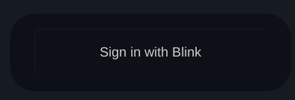
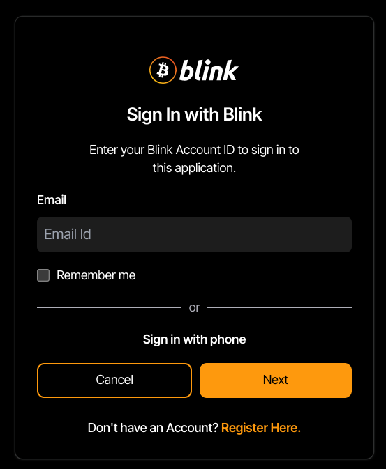
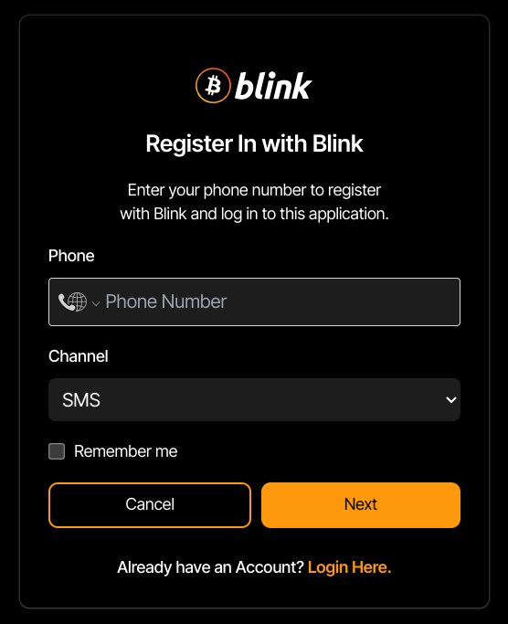
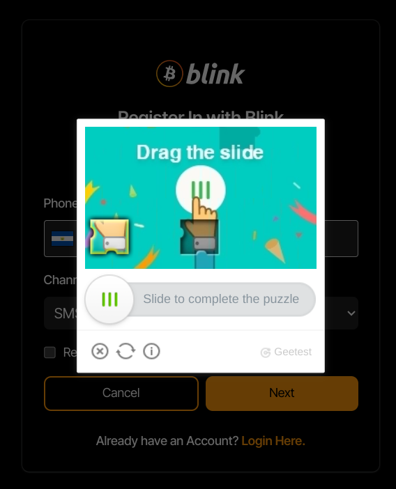
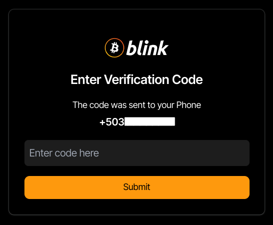

# OAuth2 integration
[OAuth2](https://oauth.net/2/) is integrated in the API using [Ory Hydra](https://www.ory.sh/hydra/).

It is configured to accept login requests through the [Blink Dashboard](https://dashboard.blink.sv).

Account creation purely through the API is currently not allowed.

## OAuth2 flow
* Open the [Blink Dashboard](https://dashboard.blink.sv)

* Click the `Sign in with Blink button`

  

* This will create a login challenge through Hydra and forward the request to `https://consent.staging.blink.sv/login?login_challenge=<challenge_token>` where the Consent app (implementing the OAuth2 login) is exposed.

* Click the `Register Here` link to create a new account using a phone number:

  

* Create a new account on the next page:

  

* There will be a captcha presented before sending a message to a phone number (there is no captcha when using an email to request the code):

  

* Use the code from the SMS / Whatsapp or email (and your 2FA code is set) to complete the process

  

* When the login or registration is completed the Consent app will redirect to a predefined callback address (here the Blink Dashboard with access to the wallet info, transaction history and other features as an example).

  

## Adding a new application
* A new application to use the OAuth2 flow needs to be manually approved to be able to generate a `login_challenge` through Hydra
* the callback address where the user will be redirected to after login needs to be defined.

Please contact the dev team on [chat.galoy.io](https://chat.galoy.io) to use OAuth2 to integrate an external app with the Blink API.

## More details
* See the [readme of the Consent app](https://github.com/GaloyMoney/galoy/tree/main/apps/consent#readme)
