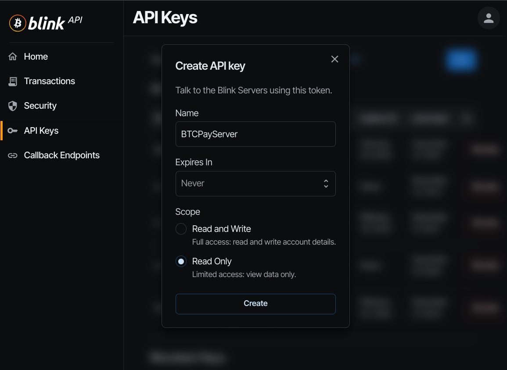
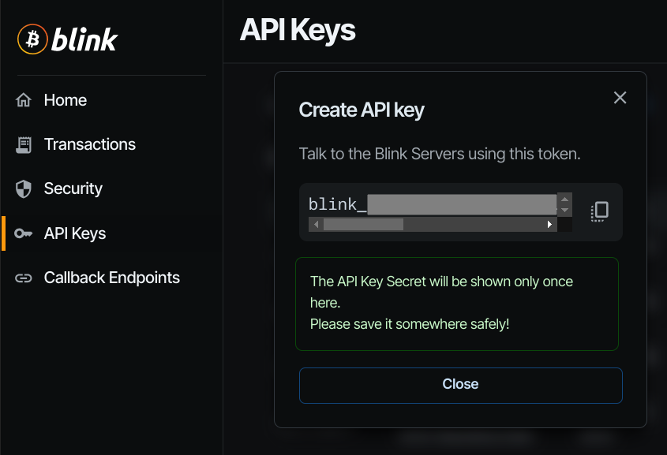

Use Blink as a lightning provider in [BTCPay Server](https://btcpayserver.org).<br />
Add the default wallet or select between BTC and Stablesats.

Available in BTCPay Server v1.12.0 and later.

## How to activate the plugin
* login to the BTCPay Server instance as an admin user
* select `Manage Plugins` in the left sidebar and install the Blink plugin:

  

* restart the BTCPay Server instance.

## How to connect

* Create an API key on [dashboard.blink.sv](https://dashboard.blink.sv)
  * log in with your registered email or a phone number
  * select API Keys in the menu on the left
  * create an API key with the + button
  * for the most secure option choose the `Read Only` Scope - using a read only key will allow to create invoices and receive payments to your Blink account, but will not be allowed to send payments with the BTCPay Server plugin.

    

  * copy the API key and save it securely as a password

    

* the option to connect to their Blink will be available for logged in users under:
  * in  case of a new store:<br />
    `Set up a lightning node` → `Use custom node`
  * in case of an existing store:<br />
    `Lightning` → `Settings` → `Change connection` → `Use custom node`

* the connection script for BTCPay Server is minimum:
  ```
  type=blink;api-key=blink_...
  ```

  

* If adding only the API key the default wallet will be used on the Blink server (https://api.blink.sv/graphql).
* the default wallet can be changed in the Blink app under `Settings` → `Default wallet`, but this would only affect the BTCPay Plugin when the connection string is reloaded.

:::note
If using the USD wallet the requested invoice amount needs to be at least 1 USDcent even if you are using another fiat denomination or SATS.
:::

### Specify the BTC or USD wallet (optional)
* to use a specific wallet (BTC or USD) copy the chosen the Wallet Id from your [dashboard.blink.sv](https://dashboard.blink.sv)

  

* use the full connection string as:
  ```
  type=blink;server=https://api.blink.sv/graphql;api-key=blink_...;wallet-id=xyz
  ```
* can also set a custom server for development or to use an other instance of the Galoy backend

### Finalize the connection

* Click `Test connection` to verify the connection

  The message:

  

  is expected as the Blink plugin is connected to a Blink account, not a lightning node directly, but the connection is working.

* Click `Save` to save the connection.

## Enjoy the benefits of using Blink
  * instant inbound lightning liquidity
  * no channel management
  * no need to worry about backups
  * get notified of the received payments in the Blink app

## Source code
[github.com/Kukks/BTCPayServerPlugins/tree/master/Plugins/BTCPayServer.Plugins.Blink](https://github.com/Kukks/BTCPayServerPlugins/tree/master/Plugins/BTCPayServer.Plugins.Blink)
